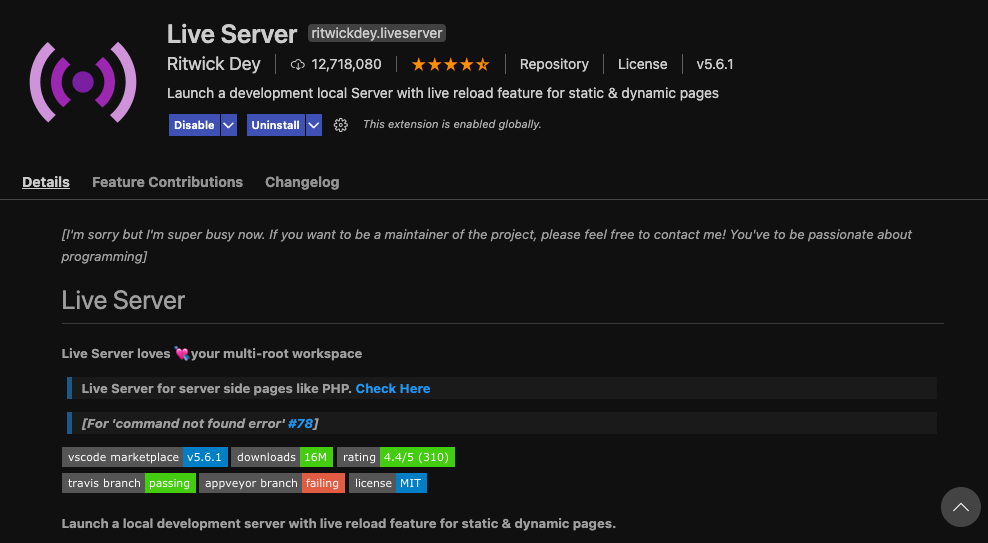
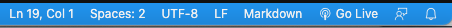

## HOW TO RUN YOUR CODE

You can run your code with Live Server. If you do not have this extension in your Visual Studio Code yet, you can search for it by clicking on the small icon with cubes in the column that is on the most left side in your VSC window:  

  

Here you can search for Live Server. This is what it looks like:  

  

After installing Live Server, you can start it **when you are in your HTML file** by using a right click, or using the button **Go Live** in the blue bar all the way at the bottom of your VSC window:  

  

Ask a coach for help if the installation does not work.

**Please note:** if your code does not run and no browser window opens automatically, first check if you are in your HTML file when you clicked on the *Go Live* button. This is the mistake we all make, so check that first 😊.
